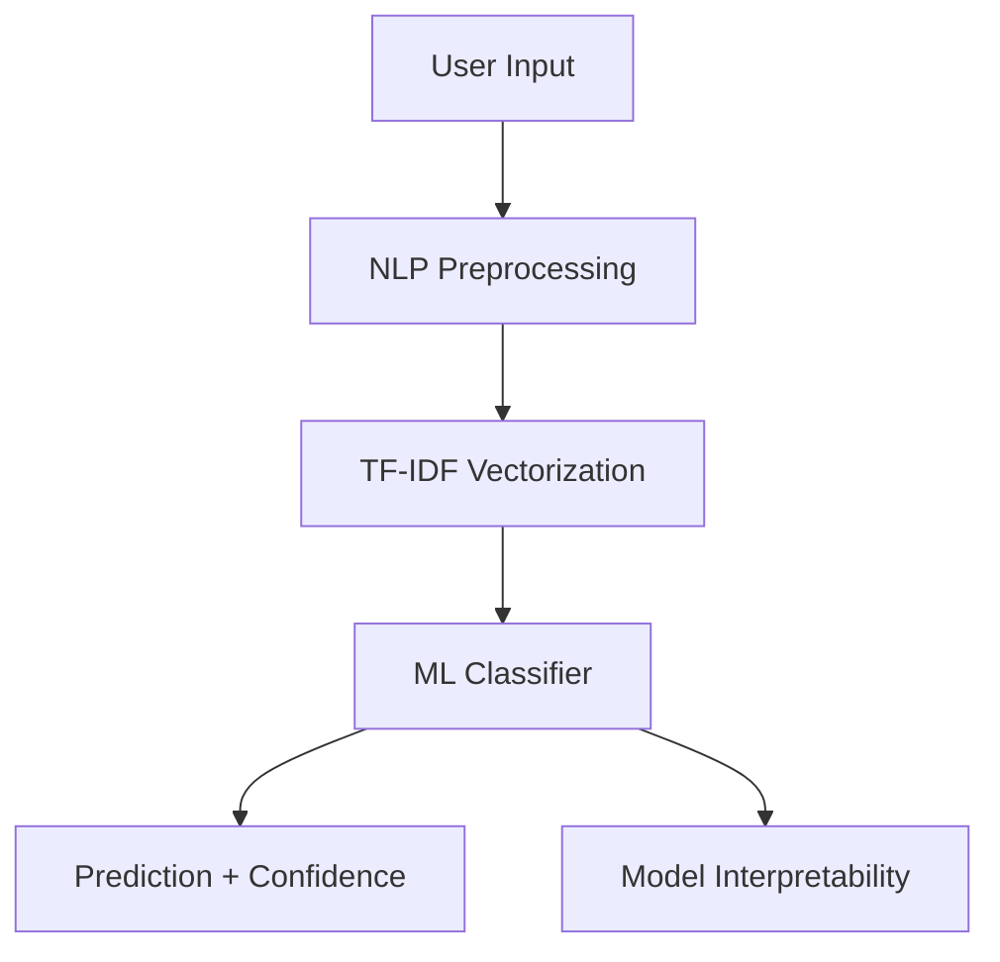

# 🧠 MoodMatrix: AI Mental Health Assistant

MoodMatrix is a technically strong, production-style NLP system designed for mental health text classification. It uses advanced machine learning pipelines to categorize user thoughts into multiple mental health-related categories.

## 🚀 Key Features
- **Scikit-learn Pipeline**: Integrated TF-IDF Vectorization and Model (Logistic Regression / Linear SVM).
- **Hyperparameter Tuning**: Optimized using `GridSearchCV` for best performance.
- **N-Gram Support**: Supports both Unigrams and Bigrams for better context capture.
- **Model Interpretability**: Visualizes the top 10 most influential words per class.
- **Modern UI**: Clean, multi-page Streamlit interface with sidebar navigation.
- **Modular Codebase**: Separated concerns across `trainer.py`, `preprocessing.py`, and `mood_app.py`.

## 🏗️ Architecture


- **Preprocessing**: Lowercasing, regex cleaning, stopword removal, and NLTK lemmatization.
- **Model**: Scikit-Learn Pipeline (`TfidfVectorizer` + `LogisticRegression`).
- **Optimization**: `GridSearchCV` tuning `C`, `ngram_range`, and `max_features`.

## 📁 Project Structure
```
MoodMatrix/
│
├── mood_app.py         # Main Streamlit application
├── trainer.py          # Automated training & tuning pipeline
├── preprocessing.py    # Reusable NLP preprocessing functions
├── data/
│   └── dataset.csv     # Training dataset
├── model/
│   ├── moodmatrix_model.joblib  # Trained pipeline
│   └── interpretability.joblib   # Extracted feature importance
├── requirements.txt    # Project dependencies
└── README.md           # Project documentation
```

## 🛠️ How to Run Locally

1. **Clone the repository** (if applicable) and navigate to the directory.
2. **Install dependencies**:
   ```bash
   pip install -r requirements.txt
   ```
3. **Train the model**:
   ```bash
   python trainer.py
   ```
4. **Launch the app**:
   ```bash
   streamlit run mood_app.py
   ```

## 📈 Future Enhancements
- **REST API**: Convert the system into a FastAPI service for integration with mobile/web apps.
- **Dockerization**: Create a Docker container for seamless deployment.
- **Cloud Deployment**: Deploy on Streamlit Cloud or AWS/GCP.
- **Deep Learning**: Integration with Transformers (HuggingFace) for even higher accuracy.

---
*Disclaimer: This tool is for educational purposes only and is not a substitute for professional medical advice.*
