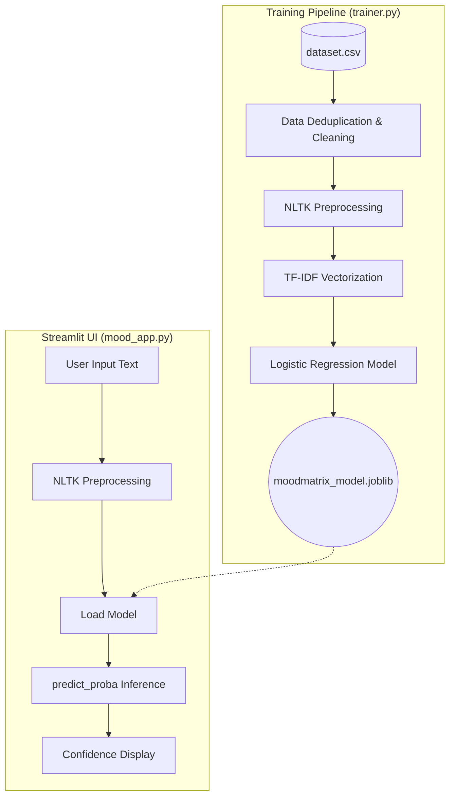

# MoodMatrix: AI Mental Health Assistant

An NLP-based mental health text classifier designed to categorize statements into one of seven emotional/clinical states. 

> **Disclaimer:** This project is built for educational and portfolio demonstration purposes only. It is **not** a diagnostic tool and is not a substitute for professional medical advice, diagnosis, or treatment.

---

## 📊 Model Performance

**Final Production Model:** Logistic Regression (TF-IDF, 1-2 word grams, class-weight balanced)

The model was trained on a deduplicated dataset of 51,073 text statements. Our evaluation prioritizes **Macro F1** to ensure minority classes are measured honestly.

- **Overall Accuracy:** 75.8%
- **Macro F1 Score:** 0.702

### Per-Class Breakdown

| Class | Precision | Recall | F1-Score |
|:---|:---:|:---:|:---:|
| **Normal** | 0.894 | 0.914 | **0.904** |
| **Anxiety** | 0.771 | 0.831 | **0.800** |
| **Bipolar** | 0.742 | 0.766 | **0.754** |
| **Depression** | 0.778 | 0.623 | **0.692** |
| **Suicidal** | 0.648 | 0.725 | **0.684** |
| **Stress** | 0.478 | 0.638 | **0.547** |
| **Personality disorder** | 0.472 | 0.620 | **0.536** |

---

## ⚠️ Known Limitations

An honest look at the model's current boundaries:
1. **The `Normal` Class is Noisy:** Because "Normal" is a broad catch-all in the dataset, everyday ambiguous language (e.g., "I have a big presentation tomorrow and I'm freaking out") often gets pulled toward `Normal` rather than clinical `Anxiety` or `Stress`.
2. **Weak Minority Classes:** `Stress` and `Personality disorder` are by far our weakest performers (F1 ~0.54). This is directly tied to a lack of representation in the training data: `Stress` has only 2,669 rows and `Personality disorder` has just 1,201 rows (compared to 16,039 for `Normal`).

---

## 🛠️ Tech Stack

This project strictly relies on a lightweight, native Python stack without external deep learning dependencies:
- **Language:** Python
- **Machine Learning:** `scikit-learn` (TF-IDF, LogisticRegression, LinearSVC, SGDClassifier, GridSearchCV)
- **NLP Processing:** `nltk` (Stopwords, WordNet Lemmatization)
- **UI Framework:** `streamlit`
- **Data Handling & Viz:** `pandas`, `numpy`, `matplotlib`, `seaborn`

*(Note: We explored deep learning embeddings (`sentence-transformers`), but native TF-IDF outperformed them on Macro F1 for this specific dataset and was chosen for the final deployment.)*

---

## 🚀 Setup & How to Run

1. **Clone the repository:**
   ```bash
   git clone https://github.com/shreyashpadwal/MoodMatrix-AI-Mental-Health-Assistant.git
   cd MoodMatrix-AI-Mental-Health-Assistant
   ```

2. **Install dependencies:**
   ```bash
   pip install -r requirements.txt
   ```

3. **(Optional) Retrain the model:**
   This will run the full preprocessing, hyperparameter grid search, and evaluation pipeline, outputting the final model artifacts.
   ```bash
   python trainer.py
   ```

4. **Run the web application:**
   ```bash
   streamlit run mood_app.py
   ```

---

## 🏛️ System Architecture



---

## 📂 Project Structure

```text
MoodMatrix-AI-Mental-Health-Assistant/
├── mood_app.py                # Main Streamlit web application
├── trainer.py                 # Core model training & evaluation pipeline
├── preprocessing.py           # NLTK text cleaning & lemmatization rules
├── requirements.txt           # Pinned dependencies
├── nltk.txt                   # NLTK data requirements for Streamlit Cloud
├── .gitignore                 # Git exclusions (ignores large model artifacts)
├── README.md                  # Project documentation
├── data/
│   └── dataset.csv            # 51k row mental health statement dataset
├── model/                     # (Generated) Production artifacts
│   ├── moodmatrix_model.joblib
│   ├── moodmatrix_tfidf.joblib
│   ├── metrics.json           
│   ├── interpretability.joblib
│   └── confusion_matrix.png   
└── tests/                     # Test suite
    ├── test_preprocessing.py
    └── test_pipeline_smoke.py
```
